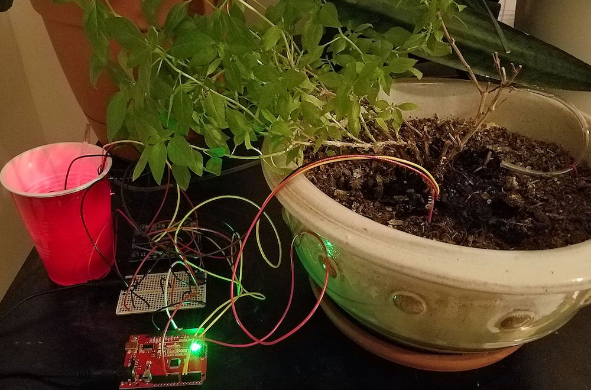
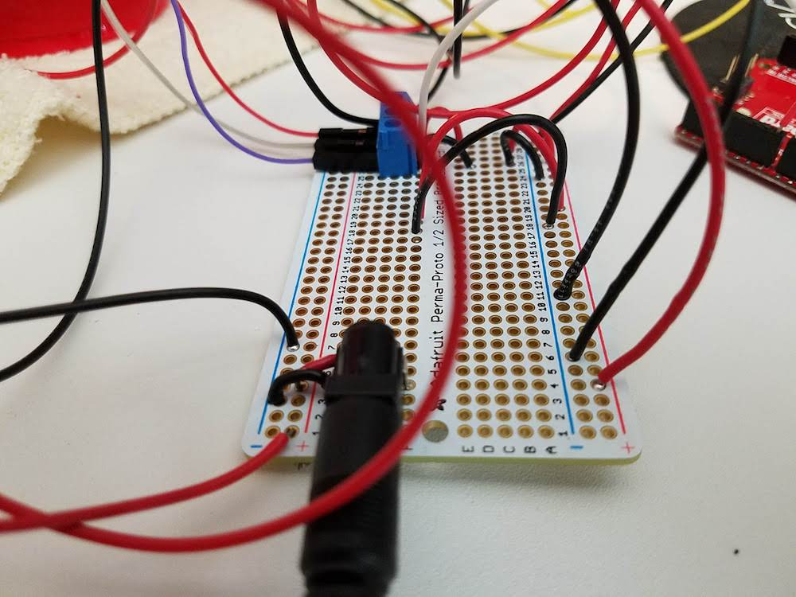
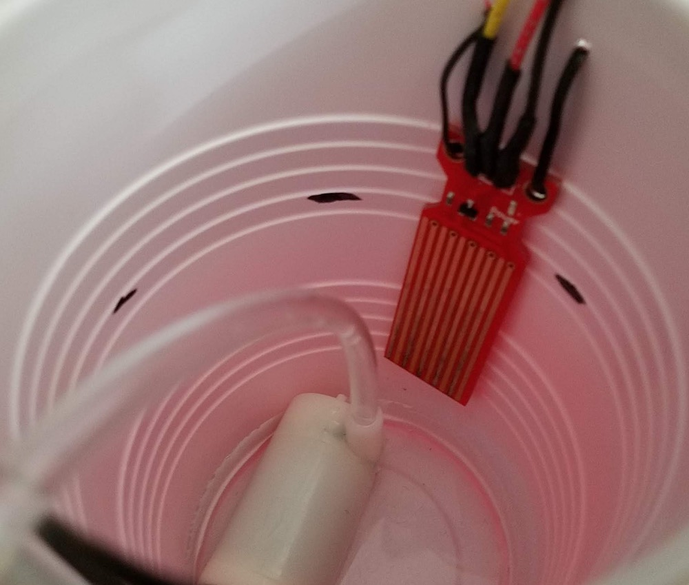

# Self Watering Plant using Sparkfun Redboard + Johnny-Five

## Summary
Using the following pieces of equipment:
- [Moisture Sensor](https://www.sparkfun.com/products/13322)
- [Water Level Sensor](https://www.tutorialspoint.com/arduino/arduino_water_detector_sensor.htm)
- [4 Channel DC 5V Power Relay](https://www.amazon.com/JBtek-Channel-Module-Arduino-Raspberry/dp/B00KTEN3TM)
- [Sparkfun RedBoard](https://www.sparkfun.com/products/13975)
- [Submersible Water Pump](https://www.amazon.com/Small-Water-Pump-4-5v-Available/dp/B077X1NKRL)

I created a watering system that would allow a plant whose moisture falls below a certain threshold to be able to get water from a water source that has enough water to be able to water the plant.

## How it works

### Check the Water Level
The container which holds the water has the Water Level Sensor somehow attached to it to acknowledge to the microcontroller that there is enough water by checking the voltage reading coming from that sensor.

### Check the Soil Moisture Level
The plant will have a soil moisture sensor plugged into the soil to ensure that the plant has enough water and will send readings back to the microcontroller. The microcontroller logic will check if the values being sent back fall in a certain threshold value and if it does, then it will water the plant.

### If the plant is both dry and there's enough water...
The microcontroller at this point will send a signal to the 4-channel power relay which will activate the submersible water pump. The pump will continue running as long as:

a) There is enough water in the container

b) The plant is dry

If either of these conditions are `False`, then the pump will automatically turn off.

### Johnny-Five usage
I believe that this was a good exercise project to try out Johnny-Five as a framework to write for a microcontroller. To get started yourself with this project, you'll have to run the instructions located here:

https://github.com/rwaldron/johnny-five/wiki/Getting-Started

which includes instructions on how to flash your Arduino-comptabile microcontroller to be able to run this code on the microcontroller.

## Gallery

### Final Set-up

### Fritzing Diagram

### Some of the individual components

