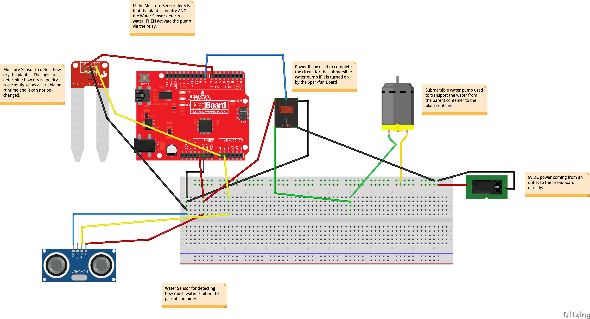

# Self Watering Plant using Sparkfun Redboard + Johnny-Five

## Summary
Using the following pieces of equipment:
- [Moisture Sensor](https://www.sparkfun.com/products/13322)
- [Sonar Sensor](https://www.robotshop.com/en/sharp-gp2y0a02yk0f-ir-range-sensor.html)
- [4 Channel DC 5V Power Relay](https://www.amazon.com/JBtek-Channel-Module-Arduino-Raspberry/dp/B00KTEN3TM)
- [Sparkfun RedBoard](https://www.sparkfun.com/products/13975)
- [Submersible Water Pump](https://www.amazon.com/Small-Water-Pump-4-5v-Available/dp/B077X1NKRL)

I created a watering system that would allow a plant whose moisture falls below a certain threshold to be able to get water from a water source that has enough water to be able to water the plant.

Note: A 1-Channel DC 5V Power Relay is also acceptable

## How it works

### Check the Water Level
The container which holds the water has a Sonar Sensor that is checking the level of the water every second.

This is used to ensure that if the soil becomes too dry, that there is any water at all to pump out and deliver to the plant.

The surface of the water is _not_ capable of creating a hard enough surface to reflect back an accurate reading as to how much water is in the container. That is why I'm using a foam material that floats on the surface to bounce off of to get a more accurate reading.

### Check the Soil Moisture Level
The plant has a soil moisture sensor plugged into the soil to ensure that the plant has enough water and will send readings back to the microcontroller.

The microcontroller logic will check if the values being sent back fall in a certain threshold value and if it does, then it will water the plant.

### If the plant is both dry and there's enough water...
The microcontroller at this point will send a signal to the 4-channel power relay which will activate the submersible water pump. The pump will continue running as long as:

a) There is enough water in the container

b) The plant is dry

If either of these conditions are `False`, then the pump will automatically turn off.

### Johnny-Five usage
I believe that this was a good exercise project to try out Johnny-Five as a framework to write for a microcontroller. To get started yourself with this project, you'll have to run the instructions located here:

https://github.com/rwaldron/johnny-five/wiki/Getting-Started

which includes instructions on how to flash your Arduino-comptabile microcontroller to be able to run this code on the microcontroller.

### Caveats
Before starting this project, I had falsely assumed that Johnny-Five was capable of running the Javascript code as if it was somehow read and transcribed into the Java code that was necessary for the Arduino.

What Johnny-Five does instead, is that there's a *host machine* that is running a Node.js process that will actively transcribe the code for the Arduino.

Meaning that there has to be a machine that is able to run Node.js that is running along side the Arduino. This machine does not need to be another computer altogether - but a Raspberry Pi works out for this particular solution.

## Gallery

### Final Set-up

### Fritzing Diagram

### Some of the individual components

